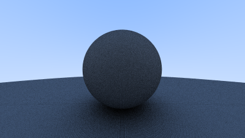

# rt-onewknd
Following the Ray Tracing in One Weekend tutorial.

## Setup
If you want to use this project with visual studio (or xcode or something else), clone the repo, navigate to the main folder, and type the command `vendor/premake/premake5.exe vs2019`. Switch out `vs2019` to the correct code for your IDE as per the [premake module guidelines](https://github.com/premake/premake-core/wiki/Modules). 
## Results
### 8/21/20...Generated the first "cool" image.
